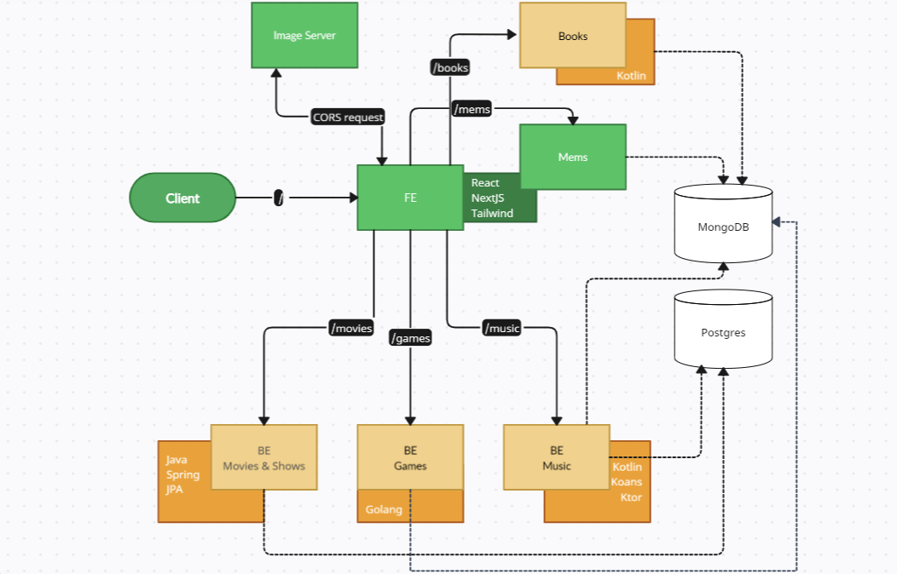

## Multi stack app
  My project to work with different things to display some interesting data
###  Diagram of communications

### Run dbs locally
use docker-compose -f mems-and-front/lib/db-docker-compose.yml up to launch mongo db

#### how to find volumes locally
`docker volume ls` - show list of volumes
`docker volume inspect <volume_name>` - detailed data about vol
`docker cp <container_id>:<mongo_data_value> ./<new_folder>` - copy data to the local storage

### Look at each project readme to see the important data about it.
[FE mems and books](mems-and-front/README.md)

[BE Games](Nameless/README.md)

[BE Movies and more](TwoSmokingbarrels/README.md)

[BE Music](ArbeitMachtFleisch/README.md)

[BE Image Server](ImageServer/README.md) 

### [FE] Mems&Books Stack and features
* React
* TypeScript
* NextJS
* Tailwind
* Mongo (mongoose)
* features:
  * 404 with external redirect
  * upload images to the db
  * navigation links
  * next-auth for upload
  * pagination
  * zod (server validation)

### [BE] Music Stack and features
* Kotlin
* ktor
* Postgres and Mongo DBs integration
* Liquibase migrations
* Coroutines

### [BE] Movies Stack and features
* Java
* REST API
* Spring
* PostgreSQL
* features:
  * FlyWay for migration
  * [Spring JPA](https://docs.spring.io/spring-data/jpa/reference/jpa/query-methods.html)
  * Lombok
  * I18n

### [BE] Games Stack and features
Go (Games)

#### [BE] local image http server (node)
to share local images
