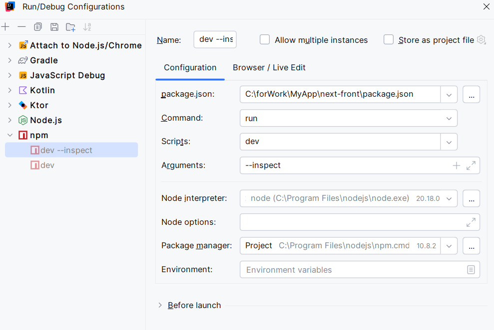

This is a [Next.js](https://nextjs.org) project bootstrapped with [`create-next-app`](https://nextjs.org/docs/app/api-reference/cli/create-next-app).

## Getting Started

First, run the development server:

```bash
npm run dev
# or
pnpm dev
```

Open [http://localhost:3000](http://localhost:3000) with your browser to see the result.

#### debug mode


### Mongo DB
use `docker-compose -f <path_to/db-docker-compose.yml up -d` to run the database for mems part

find volume locally for Docker-desktop:
v26.1.4: \\wsl$\docker-desktop\mnt\docker-desktop-disk\data\docker\volumes

