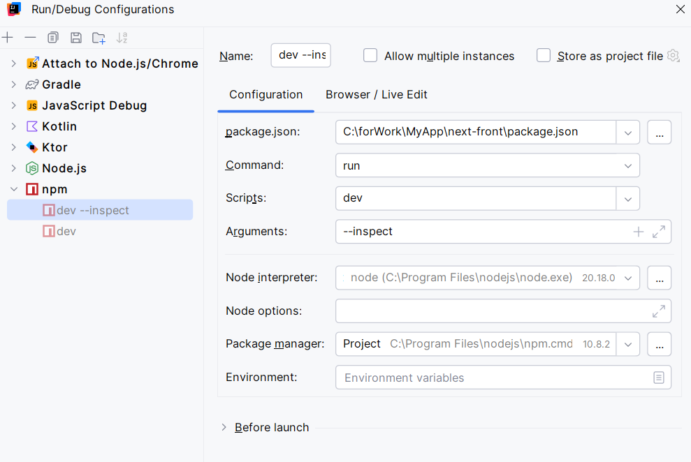

#### debug mode

### Mongo DB
use `docker-compose -f <path_to/db-docker-compose.yml up -d` to run the database for FE

find volume locally for Docker-desktop:
v26.1.4: \\wsl$\docker-desktop\mnt\docker-desktop-disk\data\docker\volumes

### todo 
* (movies api) use i8n key\vals in the page
* (movies api) checkbox with tags on movie's card creation
* FE for Games (something new)
* 404 page content was moved
* error handling from BE
* exception handling (timeout for svc)
* search
* i8n (lang RU\EN switch) (partially done)
* css styles (page color, header buttons)
* split header for buttons and switcher
* different css "уходи" button for EN\RU
*
Add 500 error handling (when DB is disconnected)
app\movies\Movies.tsx (60:14) @ length
> 60 |     if (data.length === 0) {
|              ^
61 |         return 
No data found
;
62 |     }