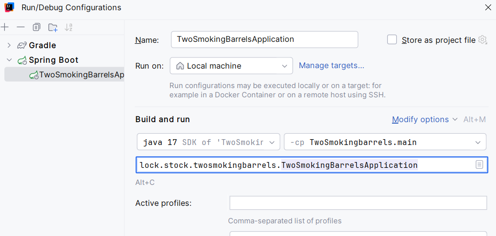

### FIRST PRIO TODO
use i8n key\vals in the page
delete vaadin
checkbox with tags on movie's card creation

Add 500 error handling (when DB is disconnected)
app\movies\Movies.tsx (60:14) @ length
> 60 |     if (data.length === 0) {
|              ^
61 |         return 
No data found
;
62 |     }

#### Mems and Front Stack and features
React,  TypeScript, NextJS, Tailwind, Mongo (mongoose) , zod (server validation)
* features:
   * hook on external redirect
   * hover with tailwind css
   * upload images to the db
   * navigation links
   * next-auth for upload mems
   * 
   * todo
   * error handling from BE
   * exception handling (timeout for svc)
   * pagination
   * search
   * i8n

#### Music Stack and features 
Kotlin ktor SQL_DB

#### Movies Stack and features
Java, REST API, Spring, PostgreSQL
* features:
   * FlyWay for migration
   * [Spring JPA](https://docs.spring.io/spring-data/jpa/reference/jpa/query-methods.html)
   * Lombok (also logs)
   * 
   * todo
   * Spring Cache
   * scala functions usage
   * GraphQL
   * i8n
   * security SB
   * Spring Boot Actuator
   * Springdoc OpenAPI
   * MAYBE:
     * Spring Data REST
     * jooq (but now JPA is used)
     * vaadin (I have a FE on NextJS)
     * login with IDP Github

#### Games Stack and features
Go (Games)

#### local http server (node)
  to share local images via http server

## !INFO BELOW FOR DEVELOPER ONLY!
To run the project:

run local image server on js:
`npm run start-server`

run front-end and mems:
`pnpm dev`

run movies with:

DBs runs on Docker, separate mongo and postgres

install DB
docker postgres 17.0
exec
su - postgres
psql
CREATE ROLE fstck_user with login SUPERUSER PASSWORD 'fstck_secret';

#### vol backup

1)copy dump with all data on it
docker exec -t <container_name> pg_dumpall -c -U <db_user> > /path/to/dump.sql
2) copy dump file dump.sql to the new place

3) for recover
cat /path/to/dump.sql | docker exec -i <container_name> psql -U <db_user>

another-1)
create a archive with volume data
docker run --rm -v <volume_name>:/volume -v $(pwd):/backup busybox tar czf /backup/volume_backup.tar.gz -C /volume .
another-2)
copy to the another place 
docker run --rm -v <volume_name>:/volume -v $(pwd):/backup busybox sh -c "cd /volume && tar xzf /backup/volume_backup.tar.gz"
